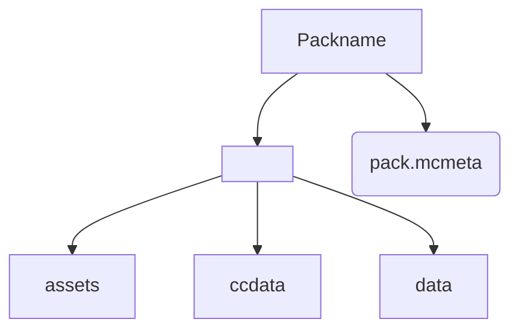
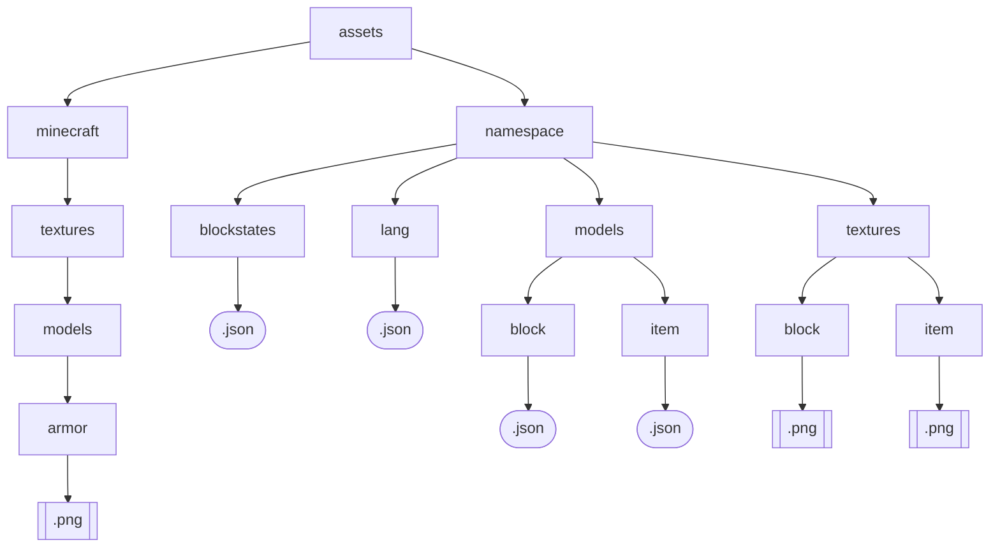
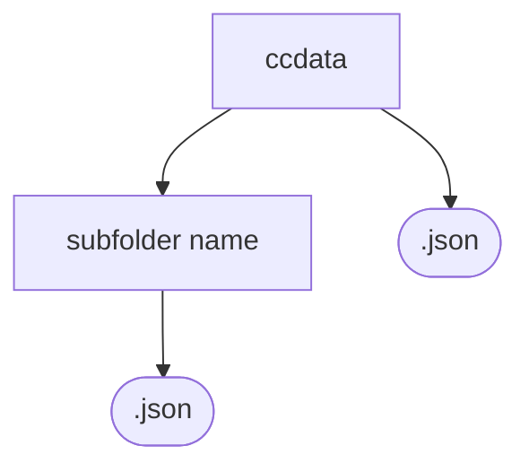
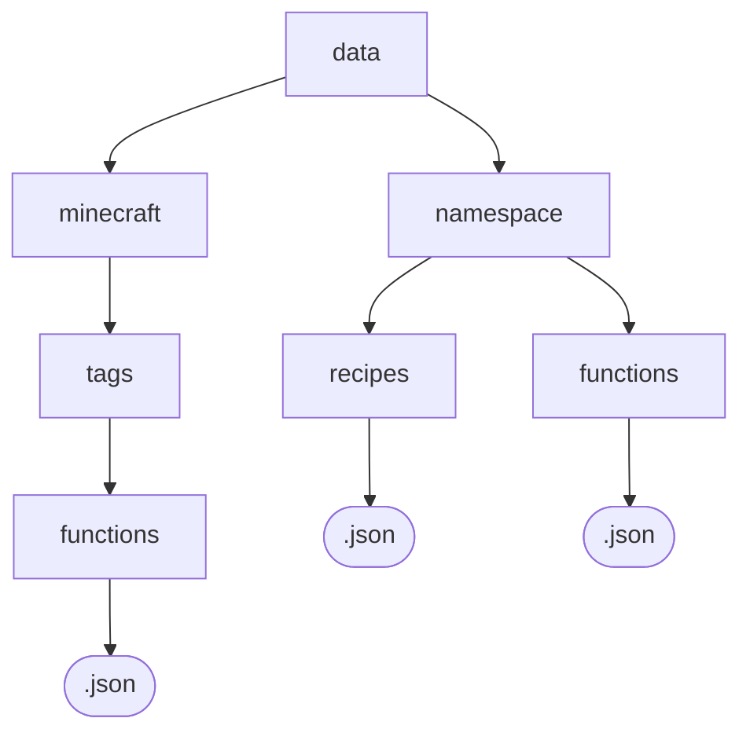

## General data structure

```mermaid
graph TD
A[Packname]
A --> B[ ]
A --> C(pack.mcmeta)
B --> E[assets]
B --> F[ccdata]
B --> G[data]
```

## Resourcepack structure

```mermaid
graph TD
E[assets]
E --> E1[minecraft] --> E1.1[textures] --> E1.2[models] --> E1.3[armor] --> E1.4[[.png]]
E --> E2[namespace]
E2 --> E2.1[blockstates] --> E2.1.1([.json])
E2 --> E2.2[lang] --> E2.2.1([.json])
E2 --> E2.3[models]
E2.3 --> E2.3.1[block] --> E2.3.1.1([.json])
E2.3 --> E2.3.2[item] --> E2.3.2.1([.json])
E2 --> E2.4[textures]
E2.4 --> E2.4.1[block] --> E2.4.1.1[[.png]]
E2.4 --> E2.4.2[item] --> E2.4.2.1[[.png]]
```

## CCPacks structure

```mermaid
graph TD
F[ccdata]
F --> FA[subfolder name] --> FAA([.json])
F --> FB([.json])
```

## Datapack structure

```mermaid
graph TD
G[data]
G --> GA[minecraft] --> GAA[tags] --> GAAA[functions] --> GAAAA([.json])
G --> GB[namespace]
GB --> GBA[recipes] --> GBAA([.json])
GB --> GBB[functions] -->GBBA([.json])
```
